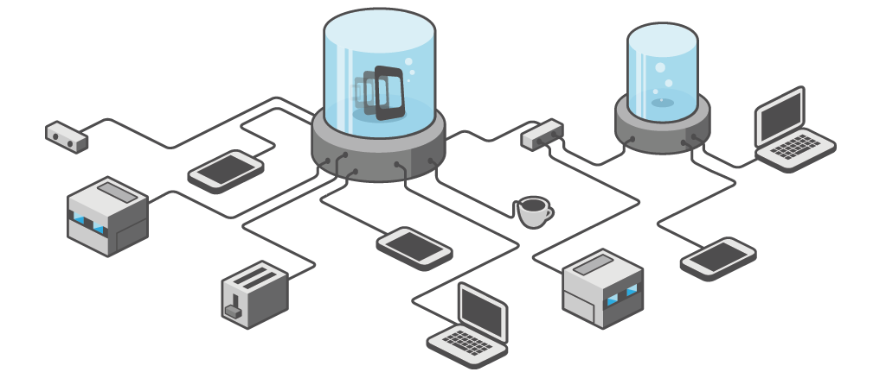
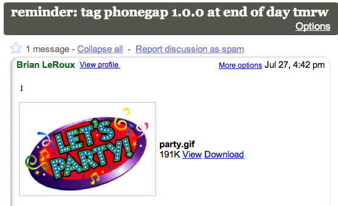

!SLIDE center

# PhoneGap Can Help

!SLIDE smbullets incremental

# wtf is PhoneGap?

* Write your app with HTML, CSS and JavaScript
* "Wrap" it up using PhoneGap
* Use device features and data via a JavaScript API
* Output: native platform binaries for six different platforms
* $$ profit $$

!SLIDE bullets incremental

# why the shit would I do that?

* Write your app once, reuse assets - cross platform baby!
* Go where no web app has gone before

!SLIDE center

!SLIDE bullets incremental

# why the shit would I do that? , continued

* use device APIs that a web app can't access
* get in the app store/world/market/place(s)

!SLIDE center

# PhoneGap is a giant polyfill

!SLIDE center

# The goal of PhoneGap is for PhoneGap not to exist

!SLIDE bullets incremental

# How does PhoneGap work?

* your HTML, CSS, JS is part of your native application package
* creates an instance of the platform's native browser, chromeless
* creates a Javascript-to-Native bridge
* implements a JavaScript interface to native functionality
  (phonegap.js)

!SLIDE center

# The PhoneGap Project

!SLIDE smbullets incremental

# The PhoneGap Project: www.phonegap.com

* Started in August 2008
* Open source, MIT-licensed (fuck yeah)
* Looks to W3C for direction (future-proof I guess?)
* Contributors include IBM (these guys seriously kill it), Palm (and others I am likely forgetting and will probably hear about it soon)
* Downloaded over 500,000 times

!SLIDE center

# PhoneGap 1.0 release _tomorrow_

!SLIDE smbullets

# PhoneGap Applications

* Logitech Squeezebox Controller
* Diary Mobile
* NFB Films
* IGN Dominate
* RNAO
* JustOneMore

#### _www.phonegap.com/apps_

!SLIDE

# PhoneGap API

## some examples

#### *docs.phonegap.com

!SLIDE

# Camera

    @@@ JavaScript
    // capture callback
    var captureSuccess = function(mediaFiles) {
      alert(mediaFiles[0].fullPath);
    };

    // capture error callback
    var captureError = function(error) {
      alert(error.code);
    };

    // start image capture
    navigator.device.capture.captureImage(
      captureSuccess, captureError, {limit:2});

!SLIDE

# Accelerometer

    @@@ JavaScript
    function onSuccess(a) {
        x = a.x;
        y = a.y;
        z = a.z;
        time = a.timestamp;
    };

    function onError() {
        alert('onError!');
    };

    // Update every 3 seconds
    var options = { frequency: 3000 };

    navigator.accelerometer.watchAcceleration(
      onSuccess, onError, options);

!SLIDE center

# Cross-platform PhoneGap

!SLIDE

# Lifecycle Events

    @@@ JavaScript
    document.addEventListener(
      "pause", onPause, false);

    function onPause() {
      clearInterval(timer_one);
      clearInterval(timer_two);
    }

    document.addEventListener(
      "resume", onResume, false);

    function onResume() {
      timer_one = setInterval(dosomething, 2000);
      timer_two = setInterval(doother, 10000);
    }

!SLIDE

# Key Events

    @@@ JavaScript
    document.addEventListener(
      "menubutton", onMenuKeyDown, false);

    function onMenuKeyDown() {
      var menu = document.getElementById("menu");
      if (menu.style.display == 'block') {
        menu.style.display = 'none';
      } else {
        menu.style.display = 'block';
      }
    }

!SLIDE center

# PhoneGap as a Hybrid

!SLIDE bullets incremental

# PhoneGap/Hybrid scenario

* Your app is delicious, standards-compliant web tech. yum.
* But it *really* needs BBM integration on BlackBerry
* ...
* Write a plugin that will bridge into native BBM functionality via JavaScript

!SLIDE smbullets incremental

* Write a native component implementing the PhoneGap Plugin interface
* Write a JS API to your native component
* Include in your PhoneGap application
* BBM users rejoice
